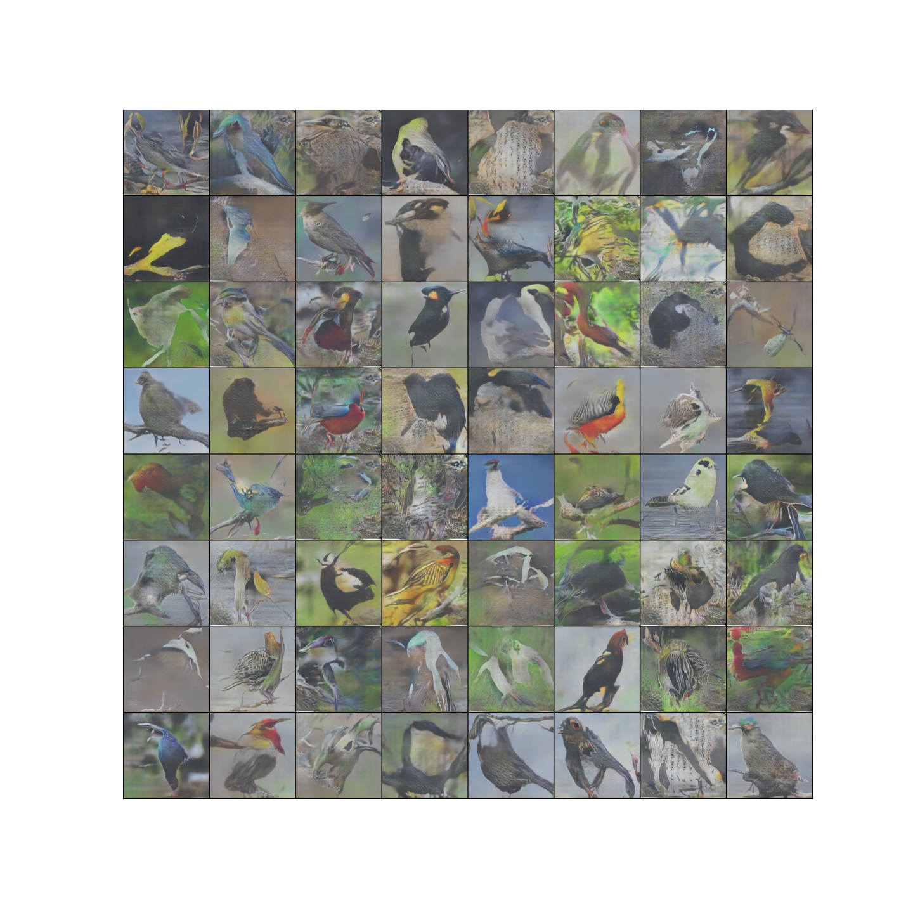
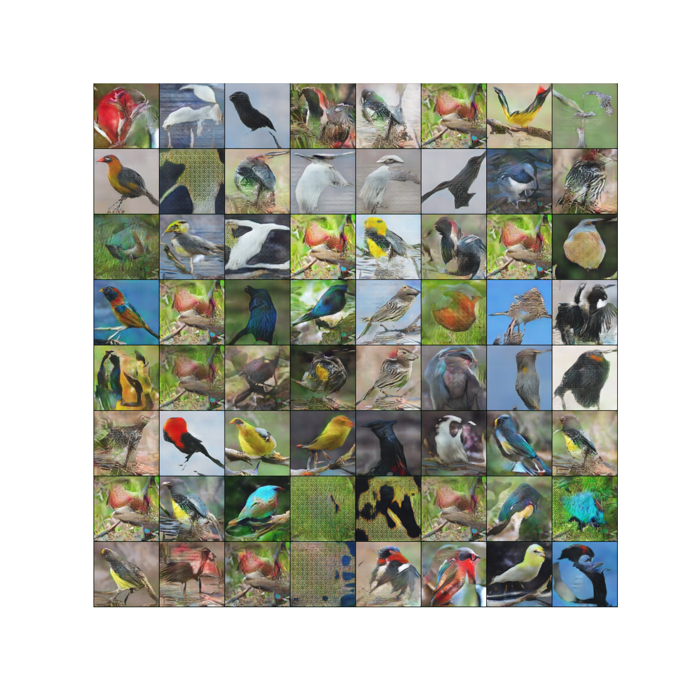

# this-bird-does-not-exist

## Dataset

260 Bird Species dataset accessed through [Kaggle](https://www.kaggle.com/gpiosenka/100-bird-species)

## Sample Generated Images

### Generated from GAN (trained for 195 epochs, lr = 0.0002)

### Generated from WGAN-GP (trained for 110 epochs, number of generators = 5, number of critics = 1, lr = 0.0002)

### References

Goodfellow et al. Generative Adversarial Networks. [arXiv](https://arxiv.org/abs/1406.2661)

Gulrajani et al. Improved Training of Wasserstein GANs. [arXiv](https://arxiv.org/pdf/1704.00028.pdf)
